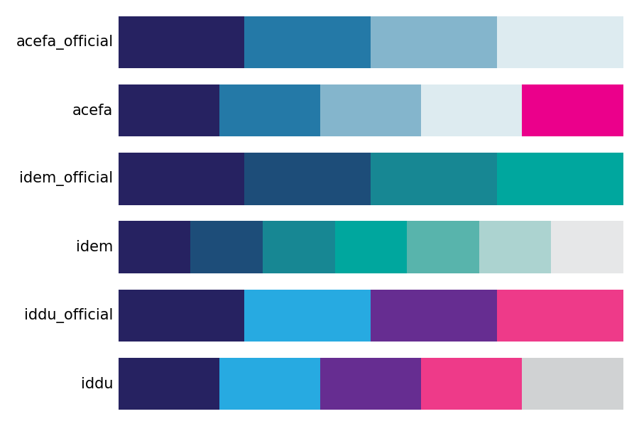

# idpalette

A Python version of the [idpalette](https://github.com/idem-lab/idpalette) package, which provides colour palettes based on the ACEFA, IDDU, and IDEM logos.

## Colour palettes



## Usage

Retrieve colour values with ``idpalette(name, n=None)`` for use with, e.g., [plotnine](https://plotnine.org/):

```py
import idpalette as idp
import plotnine as pn

acefa_colours = idp.idpalette('acefa')
acefa_scale = pn.scale_colour_manual(values=acefa_colours)
```

Create colour maps with ``mpl_colour_map(name, n=None)`` for use with [matplotlib](https://matplotlib.org/):

```py
import idpalette as idp

acefa_cmap = idp.mpl_colour_map('acefa')
```
